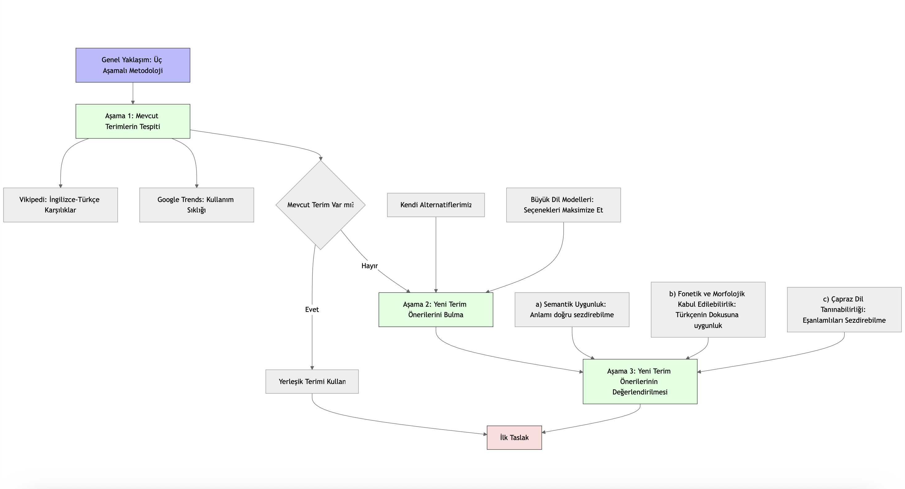

# Türkçe Gelişmiş Yapay Zeka Sözlüğü

## Proje Hakkında

Yapay zekâ ve yapay zekâ güvenliği alanındaki İngilizce terimlerin Türkçe karşılıklarını içeren kapsamlı bir sözlük. Bu projeyle, Türkiye'de yapay zekâ alanında ortak bir dil oluşturmayı ve bu alandaki bilgi paylaşımını kolaylaştırmayı hedefliyoruz.

## Amacımız

Son yıllarda yapay zekâ, sadece teknoloji uzmanlarının değil, medyanın ve günlük sohbetlerin de vazgeçilmez konularından biri haline geldi. Ancak yapay zekâ hakkındaki çoğu terimin uygun ve yaygın karşılıkları mevcut değil.

Bu eksikliği gidererek; yapay zekâ güvenliği çalışmaları için Türkçede ortak bir dil oluşturmayı, terimleri Türkçeleştirerek geniş halk kitleleri için daha erişilebilir kılmayı ve böylece Türkiye'deki yapay zekâ okur yazarlığını artırmayı hedefliyoruz.

## İçerik

Sözlük an itibarıyla **152 terim** içermekte olup, aşağıdaki 6 ana kategoriye ayrılmıştır:

| Kategori | Açıklama |
|----------|----------|
| **Temel Kavramlar** | Yapay zeka alanının temel terminolojisi |
| **Derin Öğrenme** | Derin öğrenme mimarisi ve teknikleri |
| **Büyük Dil Modelleri** | Büyük dil modelleri (LLM) ve ilgili kavramlar |
| **Yapay Zekâ Güvenliği & Etik** | AI güvenliği, etik ve risk yönetimi |
| **Yapay Zekâ Uyumlandırma** | YZ Uyumlandırması (Alignment) konuları |
| **Diğer Teknik & Yönetişim** | Teknik ve yönetişim terimleri |

## Kullanım

### CSV Dosyası Yapısı

```csv
Kategori,İngilizce Terim,Türkçe Çeviriler
Temel Kavramlar,Artificial Intelligence (AI),yapay zekâ
Temel Kavramlar,Machine Learning,makine öğrenmesi
...
```

### Dosya İndirme

Repository'deki `english-turkish-ai-dictionary.csv` dosyasını doğrudan indirebilir veya klonlayabilirsiniz:

```bash
git clone https://github.com/AI-Safety-Turkiye/english-turkish-ai-dictionary.git
```

## 📚 Metodoloji
### Genel Yaklaşım
Sözlüğün ilk taslağının hazırlanmasında üç aşamalı bir metodoloji benimsedik. Önce yerleşmiş terimlerin halihazırda mevcut olup olmadığını kontrol ettik ve bu aşamanın ardından yeni terim önerilerini sistematik olarak değerlendirdik.

### 1. Mevcut Terimlerin Tespiti
Yerleşik terimlerin belirlenmesinde aşağıdaki kaynaklardan yararlandık:
- **Vikipedi:** Wikipedia'daki İngilizce maddelerin Vikipedi'deki Türkçedeki karşılıklarını inceleyerek akademik ve popüler kullanımda kabul görmüş Türkçe terimleri tespit ettik.
- **Google Trends:** Terimlerin kullanım sıklığı ve yaygınlığı için objektif bir ölçüt olarak Google Trends istatistiklerini referans aldık.

### 2. Yeni Terim Önerilerini Bulma
Yeni terim önerilerinin beyin fırtınası aşamasında büyük dil modellerinden çokça yararlandık: kendi bulduğumuz alternatif karşılıklarla bu modellerin ürettiklerini birleştirdik. Bu aşamada seçenekleri maksimize etmeyi önceliklendirdik ve modelleri buna yönelik istemlerle kullandık.

### 3. Yeni Terim Önerilerinin Değerlendirilmesi
Mevcut yerleşik bir karşılık bulamadığımız durumlarda yeni terim önerilerini aşağıdaki üç temel kritere göre değerlendirdik:

- **a) Semantik Uygunluk:** Önerilen terimin anlamını, terimle tanışık olmayan kişilere, doğru ve eksiksiz bir biçimde sezdirebilmesi.
- **b) Fonetik ve Morfolojik Kabul Edilebilirlik:** Terimin Türkçe dil yapısına uygun olması ve kulağa aşırı garip gelmemesi.
- **c) Çapraz Dil Tanınabilirliği:** Türkçe veya İngilizce terimlerinden yalnızca birini bilen bir kişinin, diğer dildeki karşılığı gördüğünde eşanlamlı olduklarını sezebilecek olması.

### 3. Sonraki Adımlar
Bu metodolojiyi sözlüğümüzün ilk taslağı için uyguladık. Gelecek sürümlerde
- Uzman görüşlerine başvurmayı
- Diğer gönüllülerden aldığımız geri bildirimleri değerlendirmeyi
planlıyoruz.



## 🤝 Katkıda Bulunma

Projeye katkılarınızı bekliyoruz! 

### Nasıl Katkıda Bulunabilirsiniz?

1. **Yeni Terim Önerisi**: "Issue" sekmesini kullanarak yeni terimler önerebilirsiniz
2. **Çeviri Düzeltme**: Mevcut çevirilere dair önerilerinizi paylaşabilirsiniz
3. **Kategori Önerisi**: Yeni kategoriler veya kategori düzenlemeleri önerebilirsiniz

### Katkı Kuralları

- ✅ Terimlerin akademik veya endüstri standardına uygun olması
- ✅ Türkçe karşılıkların anlaşılır ve kullanılabilir olması
- ✅ Kategori seçiminin uygun olması
- ✅ CSV formatına uygunluk

## 👥 Ekip

- **Yazar**: Sayhan Yalvaçer
- **Düzenleyen**: Bengüsu Özcan
- **Organizasyon**: [AI Safety Türkiye](https://github.com/AI-Safety-Turkiye)

## 📄 Lisans

Bu proje [Creative Commons Attribution 4.0 International License]([https://creativecommons.org/licenses/by/4.0/](https://creativecommons.org/licenses/by/4.0/deed.tr)) altında lisanslanmıştır.

Bu lisans şu özgürlükleri sağlar:
- **Paylaşma** — Materyali herhangi bir ortamda veya formatta kopyalayabilir ve yeniden dağıtabilirsiniz
- **Uyarlama** — Materyali remix, dönüştürme ve üzerine inşa edebilirsiniz

Tek şart: Uygun atıf yapmanız gerekmektedir.

## 📮 İletişim

- **Website**: [AI Safety Türkiye](https://aisafetyturkiye.org)
- **GitHub**: [@AI-Safety-Turkiye](https://github.com/AI-Safety-Turkiye)
- **E-posta**: hello@aisafetyturkiye.org

## 🌟 Destek

Eğer bu projemizi beğendiyseniz, ⭐ vererek destek olabilirsiniz!

---

<div align="center">

**"Zamanında 'computer' yerine 'bilgisayar' demeyi seçtiysek, belki bu kavramları da daha çok severiz."**

</div>

---

*Not: Bu sözlük sürekli henüz geliştirilme aşamasındadır. Görüş ve önerilerinizi bekliyoruz!*
